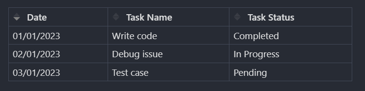

# Obsidian Table Sorting Plugin

A plugin for the [Obsidian](https://obsidian.md) note-taking app that allows you to sort the rows of your tables by clicking on the `thead` elements.

## Features

- Sort tables by clicking on the `thead` elements
- Toggle between ascending and descending order with each subsequent click
- Support for sorting tables with text or numeric data

## Usage

1. Install the plugin by following the [Manual installation instructions](https://github.com/obsidianmd/obsidian-sample-plugin#manually-installing-the-plugin) and the [Obsidian plugin installation instructions](https://help.obsidian.md/Extending+Obsidian/Community+plugins).
2. Create a table in your Obsidian note.
3. Click on a `thead` element to sort the rows of the table by that column.
4. Click on the same `thead` element again to toggle between ascending, descending and neutral order.

## Limitations

- Numeric data must be properly formatted for accurate sorting.

## Contributing

If you encounter any issues or have suggestions for future improvements, please don't hesitate to open an issue on the Github repository. Contributions are also welcome!

## License

This project is licensed under the [MIT License](LICENSE).
