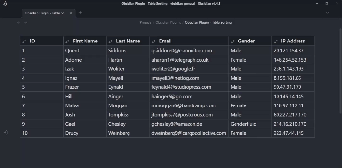

# Obsidian Table Sorting Plugin

This essential plugin will finally allow you to organize your tables non-destructively right within Obsidian. Sorting by multiple columns is supported! 

# Features

Whatever sort mode you choose, the markdown sourcecode will not be touched. Instead the sorting all happens visually. Rightly restore the original order by cycling through the modes.

## Sorting a single column

	
	
<strong>Left click</strong> on the column head.

## Sorting multiple columns simultaneously

	
	
Press <strong>Control</strong> while left-clicking.

 

## Usage
1.  Install the plugin by copying over the main.ts, styles.css and manifest.json to your vault `VaultFolder/.obsidian/plugins/obsidian-table-sorting/.
	- (optional) Also refer to the [Obsidian plugin installation instructions](https://help.obsidian.md/Extending+Obsidian/Community+plugins).
2.  Create a table in your Obsidian note.
3.  Click on a `thead` element to sort the rows of the table by that column.
4.  Click on the same `thead` element again to toggle between ascending, descending and neutral order.
5.  Use `Control + LMB` to add a column to the sorting hierarchy. 

## Limitations

- Numeric data must be properly formatted for accurate sorting.

## Contributing

If you encounter any issues or have suggestions for future improvements, please don't hesitate to open an issue on the Github repository. Contributions are also welcome!

## License

This project is licensed under the [MIT License](LICENSE).
